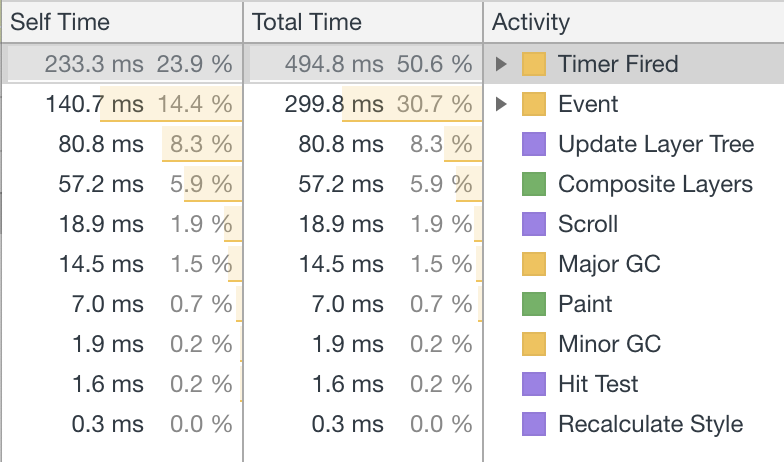
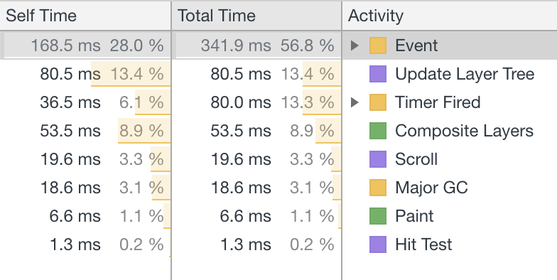

Say you have a couple of components in your React application that perform some actions
on window scroll events.  Adding a bunch of event listeners can be a big performance hit on
noisy event dispatchers, like `scroll` or `mousemove`, especially if you're wrapping those listeners
with throttle or debounce.  Wouldn't it be nice if we could subscribe to those events from our 
components and only register an event listener once?

## Install

```
yarn add react-global-event-listener
```

## Example

We're building a feed with infinite scroll. When we get to the bottom of the page,
we want to fetch the next set of items to display.  Instead of calling `window.addEventListener`
in `componentWillMount`, we can subscribe to `scroll` events on `window` using the HOC
provided by [`react-global-event-listener`](https://github.com/gzzo/react-global-event-listener): 

```js
import React from 'react'
import _ from 'lodash'
import { withGlobalEventListener } from 'react-global-event-listener'

class Feed extends React.Component {
  componentWillMount() {
    this.props.subscribeListener(
      window, 
      'scroll', 
      'Feed.onScroll', 
      this.onScroll,
      {listenerWrapper: _.partialRight(_.throttle, 200)}
    )
  }
  
  componentWillUnmount() {
    this.props.unsubscribeListener(
      window,
      'scroll',
      'Feed.onScroll'
    )
  }
  
  onScroll = () => {
    // load the next items when we reach the bottom of the feed
  }
  
  render() {
    return (
      <div>
        {this.props.items.map(item => item.title)}
      </div>
    )
  }
}

export default withGlobalEventListener(Feed)
```

If we wanted to add a button that will only appear when the page is scrolled at least 500 pixels,
we can have that component subscribe to the same `window` `scroll` event with only one event listener
actually being added to `window`.

## Performance Difference

As I mentioned above, the real difference in performance comes when you're wrapping your listeners
with throttle or debounce.  The additional overhead of these wrappers justifies the need for this library.
I performed a test with 10 event listeners using `_.throttle(f, 100)` and scrolled gently for 10 seconds. 

This is the call tree with the naive implementation:



And with [`react-global-event-listener`](https://github.com/gzzo/react-global-event-listener):



There is a ~2x difference overall.
